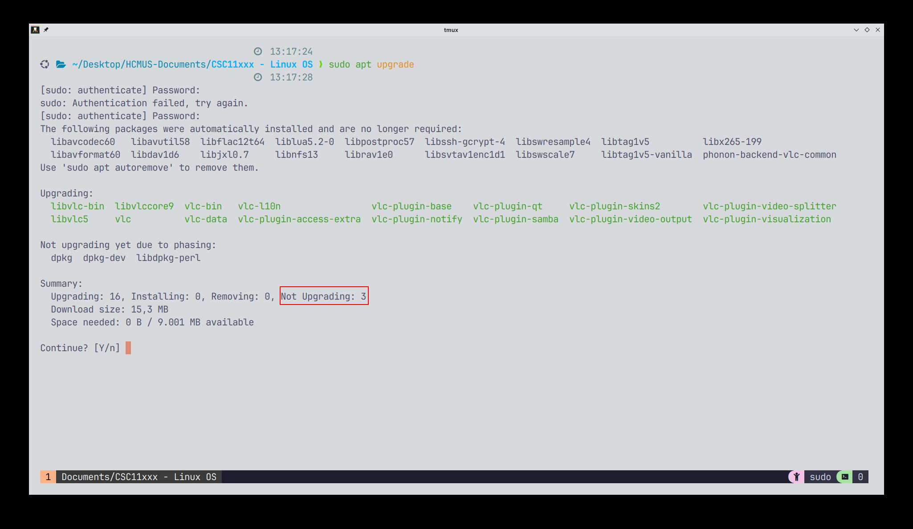
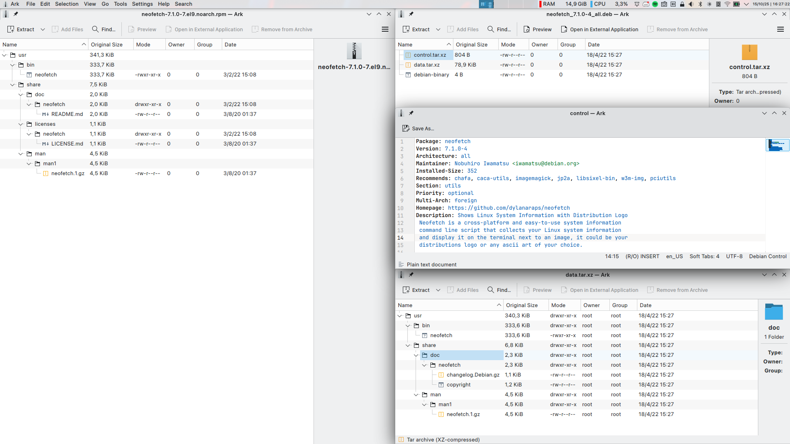
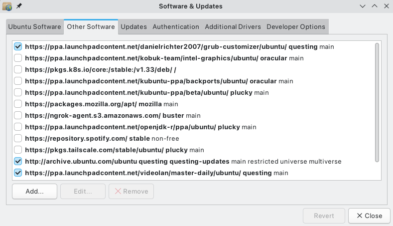

# Managing Software with APT, DNF, and Snap

## Software management on modern Linux distributions

Speakers:

- 22120368 - Phan Thanh Tiến
- 22120375 - Lưu Thái Toàn
- 22120383 - Nguyễn Đăng Trí

---

## Objectives

- Understand the role of package managers
- Add and remove a repository
- Search / install / remove packages
- Compare APT, DNF, and Snap
- Demo

---

## Background: Package managers

- A tool for **discovery**, **install**, **upgrade**, and **removal** of system package (including apps and its libraries to run). _Not limited to Linux systems!_

|                                            Windows                                            |                                                                                                                                                                 Linux                                                                                                                                                                  |                                     MacOS                                      |
| :-------------------------------------------------------------------------------------------: | :------------------------------------------------------------------------------------------------------------------------------------------------------------------------------------------------------------------------------------------------------------------------------------------------------------------------------------: | :----------------------------------------------------------------------------: |
|  |     |  |
|                                          Chocolatey                                           |                                                                                                                                       APT / DNF (Debian / RPM) • Snap • Flatpak (app sandboxing)                                                                                                                                       |                                    Homebrew                                    |

---

- They perform dependency resolution, manage metadata and caches, and apply updates
  > Inspect dependencies using `apt`: `apt-cache depends vlc`
  <!-- NOTE: Should mention dpkg/rpm -i -->
- They integrate with the OS packaging format (.deb / .rpm) and can influence system state (services, configs)
- Important for security (timely patches), reproducibility, and disk/resource sharing

---

- Types of package managers:
  - Imperative: modify system state directly (e.g., APT, DNF)
  - Application package manager: bundle app + dependencies, isolated from system (e.g., Snap, Flatpak)
  - Declarative: define desired state, system converges to it (e.g., Nix Package Manager)

---

## Background: Repositories and packages

- Repository: a remote source (URL) that exposes package metadata and files
- Packages: versioned bundles (binary + metadata) built for the distro format
- Repo metadata (indexes) enable search, dependency resolution, and fast installs via caching
- Trust model: repositories are usually signed with GPG keys — verify before adding

<div style="text-align:center">
  
</div>

---

# Imperative package formats

## `apt` and `dnf`

---

## Why "imperative"?

- The system state will change immediately after you run the command.
- "System state" includes installed packages, configuration files, services, libraries, and overall system behavior.

---

Sometimes, you may see "not upgrading" packages...



---

Because of dependency resolution:

Because package managers resolve dependency constraints before upgrading, some packages may be "held back" (not upgraded) to avoid breaking the system. Common reasons:

- Conflicting dependencies: two packages require incompatible versions of the same library; upgrading one would break the other.
- Version pinning or holds: a package or repository policy prevents newer versions from being installed.
- New or replaced packages: the upgrade requires installing, removing, or replacing packages (e.g., file conflicts) and the safe/normal upgrade command doesn't allow those changes.

How to inspect and resolve held / not-upgraded packages (APT):

1. Refresh metadata and list upgradable packages:

```bash
sudo apt update
apt list --upgradable
```

2. Check why a package is held or which versions are available:

```bash
apt policy <package>
apt-cache depends <package>
apt-cache rdepends <package>
```

3. Try the safe upgrade first (doesn't remove packages):

```bash
sudo apt upgrade
```

4. If a package is held because the upgrade needs removals/replacements, use a higher-permission upgrade that allows package replacement:

```bash
sudo apt full-upgrade    # alias for apt-get dist-upgrade; allows installing/removing packages
```

5. Fix broken dependencies and finalize:

```bash
sudo apt install -f     # attempt to fix broken deps
sudo dpkg --configure -a
```

6. Check for holds and unhold if needed:

```bash
apt-mark showhold
sudo apt-mark unhold <package>
```

7. If automated solvers struggle, use `aptitude`'s interactive resolver which often suggests acceptable dependency resolutions:

```bash
sudo aptitude
```

Equivalent checks for DNF (RPM ecosystems):

- Update metadata and check updates:

```bash
sudo dnf check-update
sudo dnf upgrade --refresh
```

- If DNF reports conflicts, you can allow replacements/removals or use `--allowerasing` to permit replacing packages that block the transaction:

```bash
sudo dnf upgrade --allowerasing
```

- To synchronize installed packages with repository versions (useful after switching repos):

```bash
sudo dnf distro-sync
```

Notes:

- Snap and Flatpak are app bundles and are generally unaffected by system-level dependency resolution because they bundle runtimes or use sandboxed runtimes.
- Always review proposed package removals before confirming a full-upgrade or using `--allowerasing` to avoid unintended removals.

---

## When install a package...

- Signature & integrity checks
<!--
  - Repositories sign Release/Packages metadata; `apt` verifies signatures when fetching
  - RPM packages and repos typically use GPG signatures (`rpm --checksig`, `gpgcheck=1` in .repo files) -->

- Resolve dependencies

- Install dependencies and the package

- Triggers and post-install integration

  <!-- - Package managers call utilities: `ldconfig` (shared libs), `update-mime-database`, `update-desktop-database`, `gtk-update-icon-cache`
  - Dpkg triggers allow deferred, batched actions to avoid repeated work during big upgrades -->

<!-- - Example inspection commands:

  - List files: `dpkg -L <pkg>` or `rpm -ql <pkg>`
  - Inspect package: `dpkg-deb -I package.deb` or `rpm -qp --info package.rpm`
  - Check status: `dpkg -s <pkg>` or `rpm -q <pkg>` -->

- Implications: DEB/RPM modify global filesystem and system state; upgrades can require config migration and service restarts

---

<!-- ## Why DEB cannot run on RPM-based systems (and vice versa)?

- Package archive layout (technical):

  - DEB: ar archive containing `debian-binary`, `control.tar.*` (control files & scripts), and `data.tar.*` (payload)
  - RPM: header metadata + cpio payload; header contains file lists, dependencies, provides, and scriptlets

---

<style>
.ref-corner {
  position: absolute;
  bottom: 60px;
  right: 40px;
  font-size: 0.7em;
  color: #888;
  text-align: right;
  z-index: 10;
}
</style>

- Both deb and rpm packages are contains of the binary file, metadata and scripts. They are different in the structure of the package and metadata, so the low level tools (dpkg and rpm) are different.
- But, if you have the binary file inside the package, you can extract it and run it on any system if the dependencies are satisfied.

<span class="ref-corner">
  <a href="https://linuxvox.com/blog/linux-deb-file/">linuxvox.com/blog/linux-deb-file/</a><br>
  <a href="https://www.man7.org/linux/man-pages/man5/deb.5.html">man7.org/linux/man-pages/man5/deb.5.html</a><br>
  <a href="https://jfearn.fedorapeople.org/en-US/RPM/4/html/RPM_Guide/ch-package-structure.html">jfearn.fedorapeople.org/en-US/RPM/4/html/RPM_Guide/ch-package-structure.html</a><br>
  <a href="http://ftp.rpm.org/max-rpm/s1-rpm-file-format-rpm-file-format.html">ftp.rpm.org/max-rpm/s1-rpm-file-format-rpm-file-format.html</a><br>
</span>

---

## Inspecting a .deb vs .rpm package

https://rhel.pkgs.org/9/epel-x86_64/neofetch-7.1.0-7.el9.noarch.rpm.html
https://debian.pkgs.org/12/debian-main-arm64/neofetch_7.1.0-4_all.deb.html

---



---

- Low-level tools and databases:

  - `dpkg` unpacks DEBs and updates `/var/lib/dpkg/` (status database); APT performs repo management and dependency solving
  - `rpm` manages the RPM DB under `/var/lib/rpm`; DNF/YUM orchestrate transactions using rpm metadata and repo data

- Maintainer scripts / scriptlets:

  - DEB: `preinst`, `postinst`, `prerm`, `postrm` — run at install/upgrade/remove
  - RPM: `%pre`, `%post`, `%preun`, `%postun` — run during package lifecycle
  - Scripts run as root and may create users, set permissions, enable services, perform migrations

---
--->

# Cross platform package managers

## Snap and Flatpak

---

## Snap packages

- Bundle the app and most of its dependencies into a single compressed file (squashfs).
- Some snaps use **shared content snaps** (like GNOME or KDE runtimes) to avoid duplicating large libraries.
- Managed by the `snapd` service, which handles installing, updating, and running snaps.
<!-- - When you run a snap:
  - `snapd` mounts the snap package as a virtual filesystem.
  - The app runs in a sandbox, isolated from the rest of the system.
  - Access to system resources is controlled by interfaces (permissions). -->

---

<style>
.ref-corner {
  position: absolute;
  bottom: 60px;
  right: 40px;
  font-size: 0.7em;
  color: #888;
  text-align: right;
  z-index: 10;
}
</style>

- Cross-distro compatibility:

  - Snaps do not rely on the host’s package manager or libraries (no .deb/.rpm needed).
  - As long as `snapd` is installed, snaps work the same way on any Linux distribution.

- Sandboxing:
  - Snaps run in a confined environment, limiting access to system resources for security.
  - Permissions are managed via interfaces that can be connected or disconnected.

<!-- add image showing snap mount and network interfaces -->

<span class="ref-corner">
  <a href="https://snapcraft.io/docs/system-architecture">snapcraft.io/docs/system-architecture</a><br>
</span>

---

## APT (Debian / Ubuntu)

- Frontends: apt, apt-get, apt-cache
- Repo files: `/etc/apt/sources.list` and `/etc/apt/sources.list.d/`
- Common commands:
  - Update metadata: `sudo apt update`
  - Search: `apt search <name>` or `apt-cache search <name>`
  - Install: `sudo apt install <package>`
  - Remove: `sudo apt remove <package>` (keep config) or `sudo apt purge <package>` (remove config)

---

## DNF (Fedora / RHEL / CentOS / AlmaLinux)

- Successor to yum on many RPM-based distros
- Repo files: `/etc/yum.repos.d/*.repo`
- Common commands:
  - Update metadata: `sudo dnf makecache` or `sudo dnf check-update`
  - Search: `dnf search <name>`
  - Install: `sudo dnf install <package>`
  - Remove: `sudo dnf remove <package>`

---

## Adding repositories

- Access newer versions, vendor packages, or 3rd-party software
- Debian/Ubuntu:
  - Add a PPA or a `.list` file in `/etc/apt/sources.list.d/`, import GPG key, then `sudo apt update`
- RHEL/CentOS/AlmaLinux:
  - Add a `.repo` file to `/etc/yum.repos.d/`, import GPG key, then `sudo dnf makecache`
  - Use `dnf config-manager --add-repo <repo-url>`
- Security: always verify repository GPG keys and prefer HTTPS where available

---

## Snap (Canonical)

- Find: `snap find <name>`
- Install: `sudo snap install <snap-name>`
- Remove: `sudo snap remove <snap-name>`
- List installed: `snap list`

https://snapcraft.io/docs/snap-howto

- _Snap is a centralized app store, managed by Canonical. So there are no way to add/remove repository like APT or DNF._

---

## Comparison: APT | DNF | Snap

| APT                                                      | DNF                                               | Snap                                                 |
| -------------------------------------------------------- | ------------------------------------------------- | ---------------------------------------------------- |
| Package format: .deb                                     | Package format: .rpm                              | Package format: snap bundle                          |
| Repo files: /etc/apt/sources.list(.d)                    | Repo files: /etc/yum.repos.d/\*.repo              | Managed by snapd (no distro repo files)              |
| Strong dependency resolution (dpkg backend)              | Dependency resolution with rich metadata, plugins | Bundles dependencies, isolated runtime (larger size) |
| System-focused packages, integrates with system services | System-focused packages, plugin ecosystem         | App-focused, sandboxed, transactional installs       |

---

| APT (Debian/Ubuntu)                              | DNF (Fedora/RHEL/AlmaLinux)                              | Snap (cross-distro)                                                 |
| ------------------------------------------------ | -------------------------------------------------------- | ------------------------------------------------------------------- |
| Typical use: system packages, servers, libraries | Typical use: system packages, enterprise RHEL ecosystems | Typical use: desktop and some server apps for cross-distro delivery |
| Pros: mature, fast, small packages               | Pros: modern metadata, modular repos                     | Pros: cross-distro, sandboxed, easy packaging                       |
| Cons: tied to Debian ecosystem                   | Cons: tied to RPM ecosystem                              | Cons: larger disk usage, sometimes slower start, requires snapd     |

---

# Demo

Install a package that not exists in default repositories by adding a new repository

https://www.sublimetext.com/docs/linux_repositories.html

---

### Debian/Ubuntu

#### Repository structure (.list file )

```
deb [repository_url] [distribution] [component]
```

- `distribution`: Specified the distribution name of the Debian (e.g., stable, buster, focal) or Ubuntu (e.g., focal, jammy)
- `component`: Define the component which can be main, contrib, and non-free

---

### Debian/Ubuntu

#### Repository structure (.sources file )

- More declarative. Being recommended recently.
- Structure:

```
Types: deb
URIs: [repository_url]
Suites: [distribution: stable, buster, focal...]
Architectures: amd64 | i386 | arm64 | all
Components: [component: main, contrib, non-free]
Signed-By: [path_to_GPG_key]
```

---

<style>
.ref-corner {
  position: absolute;
  bottom: 60px;
  right: 40px;
  font-size: 0.7em;
  color: #888;
  text-align: right;
  z-index: 10;
}
</style>

### Debian/Ubuntu

#### Add a new repository

- Edit `/etc/apt/sources.list`
- Use GUI software center (e.g., Ubuntu Software)
<span></span>
<div style="text-align:center">
  
</div>

---

```bash
# add GPG key
wget -qO - https://download.sublimetext.com/sublimehq-pub.gpg | \
  sudo tee /etc/apt/keyrings/sublimehq-pub.asc > /dev/null

# .list file
echo "deb [signed-by=/etc/apt/keyrings/sublimehq-pub.asc] https://download.sublimetext.com/ apt/stable/" \
| sudo tee /etc/apt/sources.list.d/sublime-text.list >/dev/null

# .source file
echo -e \
"Types: deb
URIs: https://download.sublimetext.com/
Suites: apt/stable/
Architectures: amd64
Components: main
Signed-By: /etc/apt/keyrings/sublimehq-pub.asc" | sudo tee /etc/apt/sources.list.d/sublime-text.source

# apt-add-repository
sudo apt-add-repository "deb [signed-by=/etc/apt/keyrings/sublimehq-pub.asc] \
        https://download.sublimetext.com/ apt/stable/"
```

<span class="ref-corner">
  <a href="https://itslinuxfoss.com/add-debian-repository/
  ">itslinuxfoss.com/add-debian-repository/</a><br>
</span>

---

### Debian/Ubuntu

#### Installing a software from added repositories

```bash
sudo apt update
apt search sublime-text | head -n 20
sudo apt install sublime-text
apt list --installed | grep sublime-text || true
sudo apt remove sublime-text

sudo add-apt-repository -r "deb https://download.sublimetext.com/ apt/stable/"
```

- GUI: Any software center (e.g., Ubuntu Software/GNONE Software/KDE Discover).
- Or Synaptic Package Manager.

---

### CentOS/RHEL/AlmaLinux

- Adding/Disabling/Removing repo: https://gist.github.com/aelkz/0dc6864cd7f3665a2780b2a111ad1a49

```bash
sudo rpm -v --import \
  https://download.sublimetext.com/sublimehq-rpm-pub.gpg
sudo dnf config-manager --add-repo \
  https://download.sublimetext.com/rpm/stable/x86_64/sublime-text.repo
```

```bash
sudo dnf makecache
sudo dnf install -y sublime-text
dnf list installed | grep sublime-text || true
sudo dnf remove -y sublime-text
sudo dnf config-manager --remove-repo \
  https://download.sublimetext.com/rpm/stable/x86_64/sublime-text.repo
```

---

### Snap

```bash
sudo apt install -y snapd
snap find hello-world | head -n 10
sudo snap install hello-world
snap list | head -n 20
sudo snap remove hello-world
```

---

## Trends & alternatives

- App distribution alternatives: Flatpak and AppImage (app sandboxing, desktop apps)
- Functional/declarative package managers: Nix / NixOS (focus on reproducibility, rollbacks)
- Containers change distribution of applications, but package managers remain important for system maintenance and shared libraries

---

## References

- man apt, man apt-get, man dnf, man snap
- https://snapcraft.io/docs
- Flatpak docs: https://flatpak.org
- Nix/NixOS introduction: https://nixos.org

---

# Thank you

Questions?

---

<!--
## Presenter notes (clarified: prerun & fallback)

- Before the demo: run these prechecks on each VM/container (prerun) to avoid delays:
  - `sudo apt update` or `sudo dnf makecache` to warm caches
  - Check network connectivity and package availability
  - Ensure `snapd` is running on Ubuntu host if you plan Snap demo
- Fallback / pre-recorded options if network or repo is slow:
  - Have screenshots or short recordings of install/remove commands ready
  - Use pre-built containers with packages preinstalled (snapshot images)
  - Explain what you'd run and show the expected output if live run fails
- Remind audience: repositories vs packages were covered earlier (background slides)

---

## Flatpak (brief)

- Flatpak is a cross-distro desktop app system that uses shared runtimes (OSTree) and user-session sandboxing
- Uses bubblewrap (unprivileged namespaces) for sandboxing and portals for controlled access (files, printing, notifications)
- Apps rely on large shared runtimes (e.g., GNOME runtime) which reduces per-app duplication
- Flatpak is user-session focused (works without systemd) and integrates via portals, differing from Snap's system-service model -->
